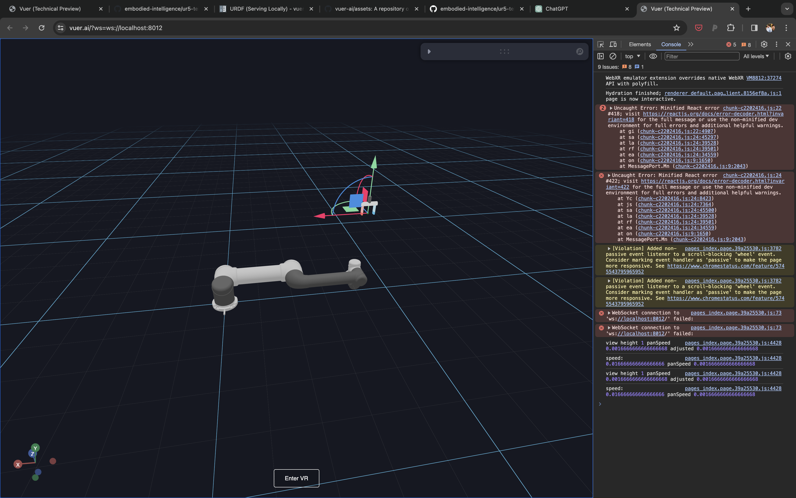
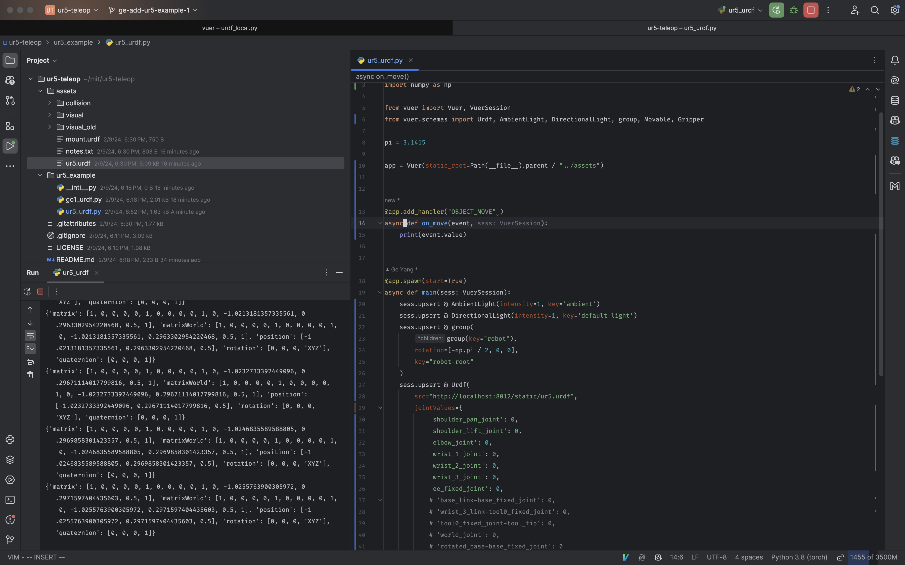

# UR5 Teleop Example

Teleoperation demo with the UR5 arm, should include

- working visualization of the UR5 in vuer
- basic IK for determining the joints of the UR5
- move the robot in response to the movement of the target object

Here is the basic setup: We have the gripper wrapped by a 
movable controller, so that you can move it around in both
web and the VR headset.

And by listening to the object move event, youc an get the
up-to-date position. Using a controller generally work
better than using hand tracking, because the noise in the
hand pose estimator. However, this is something that can be
compensated for by non-linear filtering.

